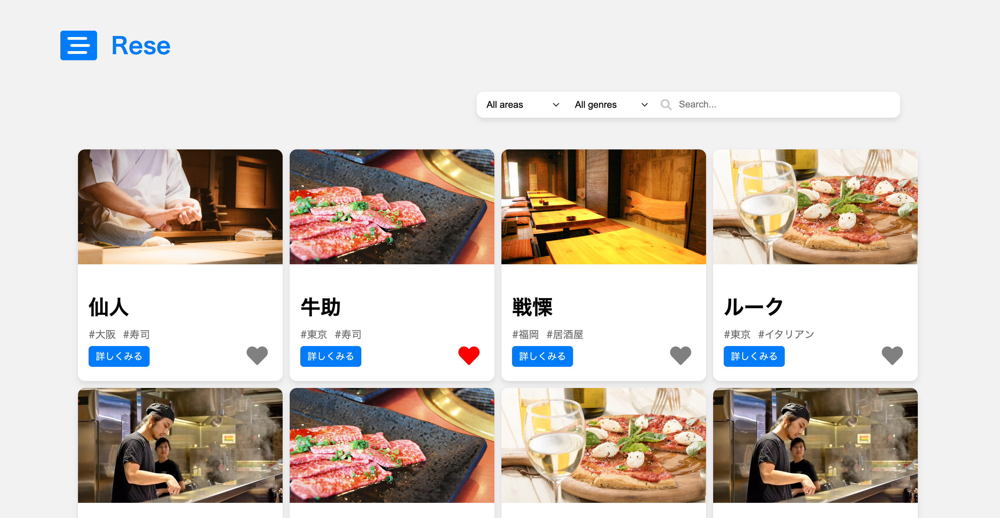
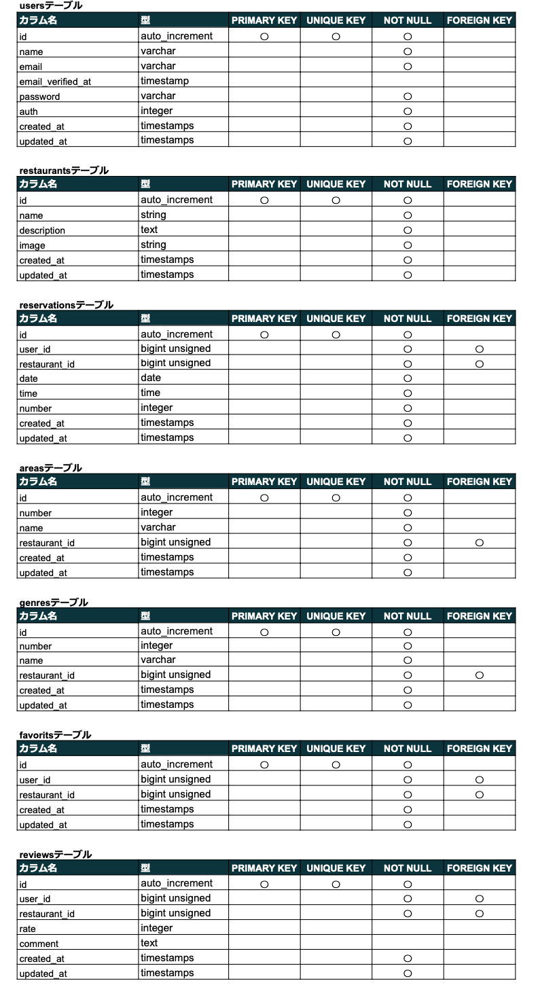
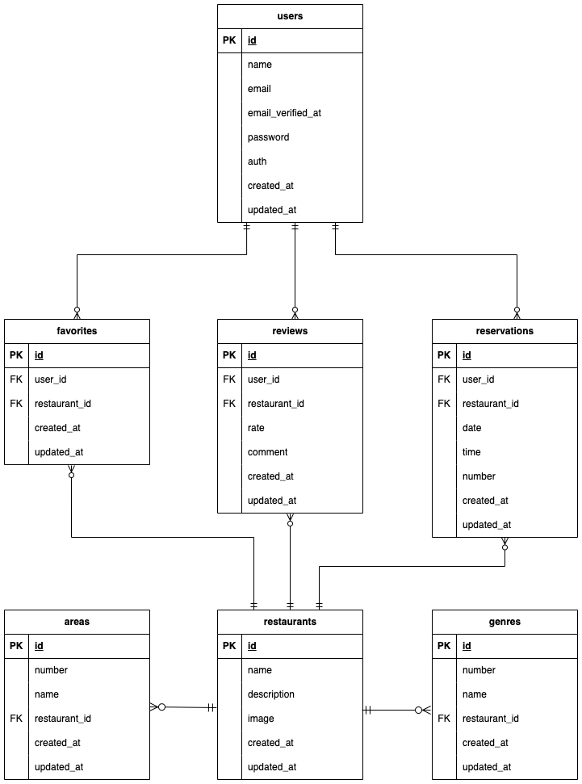

# アプリケーション名

### Rese

ある企業のグループ会社の飲食店予約サービス


## 概要説明

外部の飲食店予約サービスは手数料を取られるので自社で予約サービスを持ちたい

## アプリケーション URL

http://15.152.40.144/login

## 他のリポジトリ

なし

## 機能一覧

_一般ユーザー_

- 新規登録
- ログイン・ログアウト
- レストランの一覧表示
- レストランの検索・絞り込み
- レストラン予約機能
- レビュー投稿・評価機能
- マイページ
- 支払い機能
- 口コミ登録・編集・削除

_管理者のみの_

- 店舗代表者登録
- メール一括送信
- 口コミ削除
- CSV ファイルで店舗情報を新規登録

_店舗代表者のみの機能_

- レストラン登録
- 予約一覧表示
- QR による予約確認

## 使用技術(実行環境)

- PHP 8.1
- Laravel 10.48.17
- MySQL 8.0.26

## テーブル設計



## ER 図



## 環境構築

### Docker ビルド

1. git clone git@github.com:AKawamuraCop/Rese.git
2. DockerDesktop アプリを立ち上げる
3. docker-compose up -d —build

### Laravel 環境構築

1. docker-compose exec php bash
2. composer install
3. 「.env.example」ファイルを「.env」ファイルに命名を変更。または、新しく.env ファイルを作成。
4. .env に以下の環境変数を追加

```
DB_CONNECTION=mysql
DB_HOST=mysql
DB_PORT=3306
DB_DATABASE=laravel_db
DB_USERNAME=laravel_user
DB_PASSWORD=laravel_pass
```

```
MAIL_MAILER=smtp
MAIL_HOST=mailhog
MAIL_PORT=1025
MAIL_USERNAME=null
MAIL_PASSWORD=null
MAIL_ENCRYPTION=null
MAIL_FROM_ADDRESS=your_email@example.com
MAIL_FROM_NAME="Your Name or Your App Name"
```

```
STRIPE_PUBLIC_KEY=pk_test_51Q8UoSHvlMYyO94eZfhM7wpMxilCZdnAGx9KNvWNSwF82UCk7GvJrRrufPdpcWehgbUqI6vFkA5mO0mfEiDDFzhA00V0z16r2e
STRIPE_SECRET_KEY=sk_test_51Q8UoSHvlMYyO94eu0BvezEXByZAhaBLxGTH5zIZZQ9ci3TxheWMbR4OpdQFuq18nxcK0aBETsVfCDQP5Thg7R7800avXJ3wJd
```

5. Cron に下記を追加

```
* * * * * /usr/local/bin/docker exec rese-php-1 php /var/www/artisan schedule:run >> /path-to-your-project/schedule.log 2>&1
```

6. アプリケーションキーの作成

```
php artisan key:generate
```

7. マイグレーションの実行

```
php artisan migrate
```

8. シーディングの実行

```
php artisan db:seed
```

## アカウントの種類

テストユーザー  
店舗代表者  
管理者

## URL

・開発環境：http://localhost/  
・phpMyAdmin : http://localhost:8080/

## その他

_サブスクリプション決済テストカード_  
カード番号 : 424 242 424 242 4242  
セキュリティコード : 任意の３桁の数字  
日付 : 任意の将来の日付

_csv ファイル記述方法_
1 行目をヘッダーとすし、下記項目を設定する  
1 カラム目:店舗名  
2 カラム目:店舗概要  
3 カラム目:画像URL  
4 カラム目:地域  
5 カラム目:ジャンル  